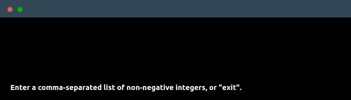

# [Sqids Haskell](https://sqids.org/haskell)

[](https://github.com/sqids/sqids-haskell/actions/workflows/haskell.yml)
[](https://opensource.org/licenses/MIT)
[](https://www.haskell.org/)
[](https://hackage.haskell.org/package/sqids)

Sqids (pronounced "squids") is a small library that lets you generate YouTube-looking IDs from numbers. It's good for link shortening, fast & URL-safe ID generation and decoding back into numbers for quicker database lookups.

### Table of contents

* [Getting started](#getting-started)
  * [Installation](#installation)
  * [Usage](#usage)
    * [Encoding](#encoding)
    * [Decoding](#decoding)
    * [Setting options](#setting-options)
    * [Monad transformer](#monad-transformer)
    * [Error handling](#error-handling)
* [Options](#%EF%B8%8F-options)
* [Errors](#-errors)
* [Notes](#notes)
* [API documentation](#-api-documentation)
* [License](#license)

## 🏃Getting started

### Installation

Sqids is available on Hackage ([hackage.haskell.org/package/sqids](https://hackage.haskell.org/package/sqids)). To install this package, run:

```
cabal install sqids
```

Or using [Stack](https://docs.haskellstack.org/en/stable/):

```
stack install sqids
```

### Usage

Use `encode` to translate a list of non-negative integers into an ID, and
`decode` to retrieve back the list of numbers encoded by an ID.

```
encode :: [Int] -> Sqids Text
decode:: Text -> Sqids [Int]
```

These functions return (monadic) values of type `Sqids a`. Calling `sqids` or
`runSqids` (see below) is the most straightforward way to extract the `something`
from a `Sqids something` value.

```
sqids :: Sqids a -> Either SqidsError a
```

To be more accurate, this gives you a value of type `Either SqidsError a`, where
`a` is the ID in the case of `encode`. If encoding fails for some reason, then
the `Left` constructor [contains the error](#error-handling).
For some use cases, directly calling `sqids` or `runSqids` in this way is
sufficient. If you do this in multiple locations in your code, however,
especially when IO or other effects are involved, the
[`SqidsT` monad transformer](#monad-transformer) is a better choice.

#### Encoding

```haskell
module Main where

import Web.Sqids

main :: IO ()
main =
  case sqids (encode [1, 2, 3]) of
    Left  {}   -> print "Something went wrong."
    Right sqid -> print sqid
```

> The output of this program is:
>
> ```
> "8QRLaD"
> ```

#### Decoding

```haskell
{-# LANGUAGE OverloadedStrings #-}
module Main where

import Web.Sqids

main :: IO ()
main =
  case sqids (decode "8QRLaD") of
    Left  {}   -> print "Something went wrong."
    Right nums -> print nums
```

> The output of this program is:
>
> ```
> [1,2,3]
> ```

##### A note about the `OverloadedStrings` language extension

`decode` takes a `Text` value as input. If you are not compiling with `OverloadedStrings` enabled, the `"8QRLaD"` string literal in the previous example would need to be explicitly converted, using the `pack` function from `Data.Text`.

```haskell
import Data.Text (pack)
```

```haskell
decode (pack "8QRLaD")
```

#### Setting options

To pass custom options to `encode` and `decode`, use `runSqids` which takes
an additional `SqidsOptions` argument.

```
runSqids :: SqidsOptions -> Sqids a -> Either SqidsError a
```

See [here](#%EF%B8%8F-options) for available options. You can override the default values using
`defaultSqidsOptions`, and the following idiom:

```haskell
main =
  case runSqids defaultSqidsOptions{ minLength = 24 } (encode [1, 2, 3]) of
    Left  {}   -> print "Something went wrong."
    Right sqid -> print sqid
```

> The output of this program is:
>
> ```
> "75JILToVsGerOADWmT1cd0dL"
> ```

To set a custom alphabet:

```haskell
main =
  case runSqids defaultSqidsOptions{ alphabet = "0123456789ABCDEF" } (encode [1, 2, 3]) of
    Left  {}   -> print "Something went wrong."
    Right sqid -> print sqid
```

> The output of this program is:
>
> ```
> "4D9D02"
> ```

Or, you can set all options at once:

```haskell
main = do
  let options = SqidsOptions
        { alphabet  = "1234567890"
        , minLength = 8
        , blocklist = []
        }
  case runSqids options (encode [1, 2, 3]) of
    Left  {}   -> print "Something went wrong."
    Right sqid -> print sqid
```

> The output of this program is:
>
> ```
> "31764540"
> ```

#### Monad transformer

In a more realistically sized application, calling `runSqids` every time you
need to access the value returned by `encode` or `decode` isn't ideal. Instead,
you probably want to create your `SqidsOptions` once, and then do things with
the IDs across the code without having to pass the options object along every
time. Assuming your application relies on a transformer stack to combine effects
from different monads, then this implies adding the `SqidsT` transformer at
some suitable layer of the stack. Instead of `sqids` and `runSqids`, there are 
two corresponding functions to fish out the value from inside of `SqidsT`:

```
sqidsT :: Monad m => SqidsT m a -> m (Either SqidsError a)
runSqidsT :: Monad m => SqidsOptions -> SqidsT m a -> m (Either SqidsError a)
```

Below is an example where `SqidsT` is used in combination with the `Writer` and
`IO` monads.

```haskell
module Main where

import Control.Monad (forM_)
import Control.Monad.IO.Class (liftIO)
import Control.Monad.Trans.Class (lift)
import Control.Monad.Writer (WriterT, execWriterT, tell)
import Data.Text (Text)
import Web.Sqids

main :: IO ()
main = do
  w <- sqidsT (execWriterT makeIds)
  case w of
    Left  err -> print ("Error: " <> show err)
    Right ids -> print ids

makeIds :: WriterT [Text] (SqidsT IO) ()
makeIds = do
  liftIO $ print "Generating IDs"
  forM_ [1 .. 50] $ \n -> do
    sqid <- encode [n, n, n, n]
    tell [sqid]
```

> The output of this program is:
>
> ```
> "Generating IDs"
> ["QkA3AmAC","fh9rtRtv","a7totm7V","KF5Z5l4X","ngqSq2b3","pjkCJlJf","yTrOSYSQ","HKVia9J2","0gTF2Zr3","jiw7wbw1","PtNNFWFA","I0vlvGvD","08TV2Sr5","UPLILMlD","ut2A2D20","Inv5vZvK","pDkBJTJJ","P1N8FRFr","R2eqeYeY","Ki5o5Q4U","1k70bzbD","dK4cE6Es","1L7XbJbZ","FyGjG1G0","ZEMReNre","aKtMte79","UtLNL9li","o6lElt2f","1w7ebtbl","nuqNqqbk","HlVSaOJ9","IKvdvave","3cWkDSD9","oQlzlc2C","RrezeDeC","OhJcJoVR","OEJFJzVJ","oplJlm2F","u8292F2H","FZGiGzGI","dN40E9EO","Q0AdAhAR","HJVzaaJC","s08YCUdX","sW8UCadW","ZaMNekrp","X4bsWS4Z","OoJIJEVj","Rqe1eTey","3aWYDXDs"]
> ```

#### Error handling

Encoding and decoding can fail for various reasons.

```haskell
  case runSqids options (encode numbers) of
    Left SqidsNegativeNumberInInput ->
      print "Negative numbers are not allowed as input."
    _ ->
      -- etc...
```

See [here](#-errors) for possible errors.

The following is an example of how to handle errors with the help of
`MonadError`s exception-handling mechanism:

```haskell
{-# LANGUAGE OverloadedStrings #-}
module Main where

import Control.Monad.Except (catchError)
import Control.Monad.IO.Class (liftIO)
import Data.Either (fromRight)
import Data.Text (unpack)
import Text.Read (readMaybe)
import Web.Sqids

repl :: SqidsT IO ()
repl = do
  input <- liftIO $ do
    putStrLn "Enter a comma-separated list of non-negative integers, or \"exit\"."
    putStr "> "
    getLine
  if input == "exit"
    then pure ()
    else do
      case readMaybe ("[" <> input <> "]") of
        Nothing ->
          liftIO $ putStrLn "Invalid input: Please try again."
        Just numbers ->
          catchError (encode numbers >>= liftIO . putStrLn . unpack) $ \err ->
            liftIO $ case err of
              SqidsNegativeNumberInInput ->
                putStrLn "Only non-negative integers are accepted as input."
              _ ->
                putStrLn "Unexpected error"
      repl

runRepl :: IO (Either SqidsError ())
runRepl = runSqidsT defaultSqidsOptions repl

main :: IO ()
main = fromRight () <$> runRepl
```

> Program example output: 
>
> 

## ⚙️ Options

### `alphabet :: Text`

The alphabet used by the algorithm for encoding and decoding.

* Default value: `abcdefghijklmnopqrstuvwxyzABCDEFGHIJKLMNOPQRSTUVWXYZ0123456789`

### `minLength :: Int`

The minimum allowed length of IDs.

* Default value: `0`

### `blocklist :: [Text]`

A list of words that must never appear in IDs.

* Default value: See [src/Web/Sqids/Blocklist.hs](src/Web/Sqids/Blocklist.hs).
* Also see [the official Sqids blocklist repository](https://github.com/sqids/sqids-blocklist).

## 💣 Errors

### `SqidsAlphabetTooShort`

The alphabet must be at least 5 characters long.

### `SqidsAlphabetRepeatedCharacters`

The provided alphabet contains duplicate characters. E.g., `"abcdefgg"` is not
a valid alphabet.

### `SqidsInvalidMinLength`

The given `minLength` value is not within the valid range.

### `SqidsNegativeNumberInInput`

One or more numbers in the list passed to `encode` are negative. Only
non-negative integers can be used as input.

## Notes

- **Do not encode sensitive data.** These IDs can be easily decoded.
- **Default blocklist is auto-enabled.** It's configured for the most common profanity words. Create your own custom list by using the blocklist parameter, or pass an empty list to allow all words.
- Read more at https://sqids.org/haskell

## 📄 API documentation

See https://hackage.haskell.org/package/sqids.

## License

[MIT](LICENSE)
